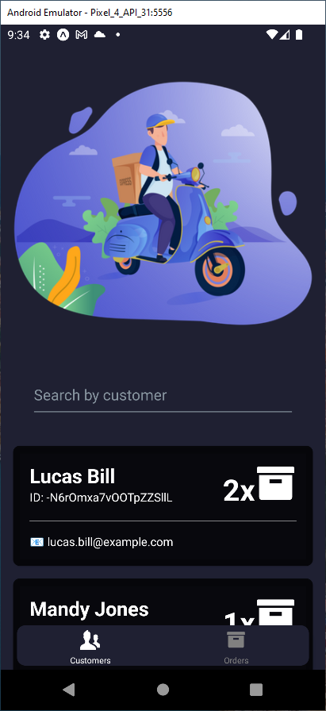
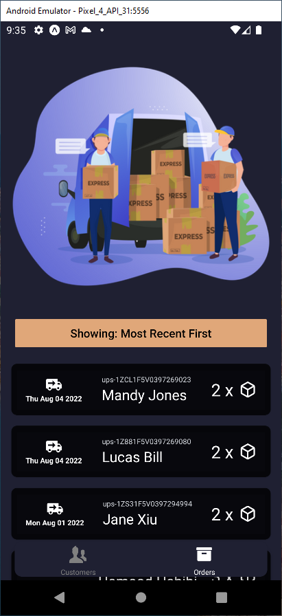
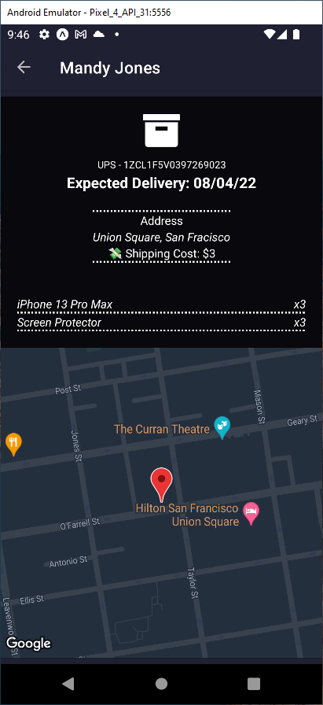

	<h1>Deleeveree</h1>
    🚚 ¿choo?

Deleeveree is a simple shipments managing & packages tracking app.

<h2>Screenshots</h2>

  
  
  

 

## Tech Stack

- Made *fast* with [React](https://reactjs.org/)
- Made *mobile* with [React Native](https://reactnative.dev/)
- Made *mobile**r*** with [Expo](https://expo.dev/)
- Made *stylish* with [React Native Elements](https://reactnativeelements.com/)
- Made *stylish**er*** with [Tailwind](https://tailwindcss.com/)
- Made *navigational* with [React Navigation](https://reactnavigation.org/)
- Made *firebased* with [Firebase](https://firebase.google.com/) `💀`
- Made *hipster* with [Graphql](https://graphql.org/) 
- Made *hipster-client* with [Apollo Client](https://www.apollographql.com/docs/react/) 

<b> ¡choo! 🚚</b>
